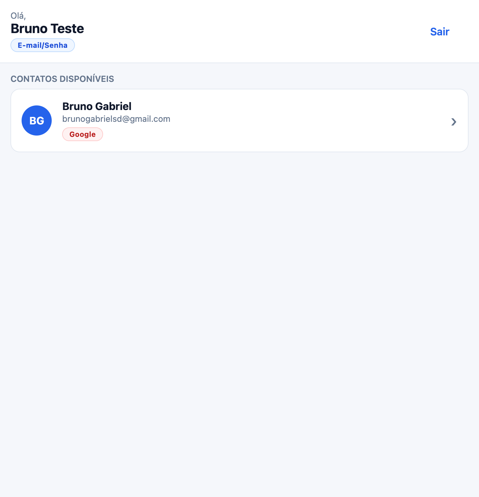
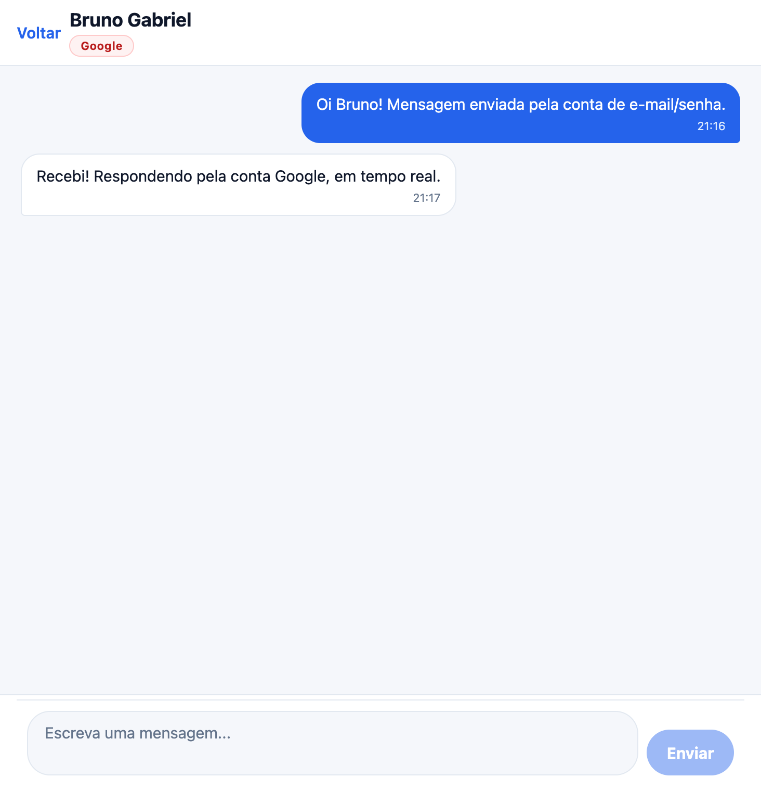

# CP4 — Chat em tempo real com React Native + Firebase

Aplicativo de chat **1 para 1** em React Native (Expo) com TypeScript, usando **Firebase Authentication**
(E-mail/Senha, Google e Apple) e **Firebase Realtime Database** para armazenar e sincronizar as mensagens
em tempo real.

## 👥 Integrantes

- RM554981 - Bruno Dominicheli
- RM556198 - Miguel Kapicius
- RM555608 - Thiago Ferreira

---

## 📝 Descrição

Cada usuário se autentica por um provedor (E-mail/Senha, Google ou Apple) e passa a enxergar **apenas os
contatos compatíveis** com a regra de comunicação do trabalho:

```
E-mail/Senha  ⟷  Google
E-mail/Senha  ⟷  Apple
```

Combinações **não** permitidas: `E-mail/Senha ⟷ E-mail/Senha`, `Google ⟷ Google`, `Apple ⟷ Apple`,
`Google ⟷ Apple`. A regra é aplicada em **duas camadas**:

1. **No cliente** (`src/utils/chatRules.ts`) — a lista de contatos já é filtrada e o envio é bloqueado
   antes de qualquer requisição, com mensagem amigável em português.
2. **No servidor** (`database.rules.json`) — as regras de segurança do Realtime Database rejeitam a
   escrita de qualquer mensagem entre dois usuários do mesmo grupo de provedor. O campo `provider` do
   perfil também é validado contra `auth.token.firebase.sign_in_provider`, de forma que um usuário não
   consegue declarar um provedor diferente do que realmente usou para entrar.

Cada conversa possui **exatamente dois participantes**, garantido pelo formato determinístico do
identificador da conversa (`uidA_uidB`, uids ordenados) e pelas regras de segurança.

---

## 🧰 Tecnologias utilizadas

| Item | Versão / Detalhe |
| --- | --- |
| React Native | 0.86.2 |
| React | 19.2.3 |
| **Expo SDK** | **57** (`expo ~57.0.16`) — requisito era SDK 54+ |
| TypeScript | 6.0.3, `strict: true` + `noUncheckedIndexedAccess` |
| Firebase JS SDK | 12.x (modular) |
| expo-auth-session / expo-crypto | Login Google no iOS/Android |
| expo-apple-authentication | Sign in with Apple (iOS) |
| expo-image-picker | Foto de perfil pela galeria ou câmera |
| @react-native-async-storage/async-storage | Persistência da sessão do Firebase Auth |
| react-native-safe-area-context | Áreas seguras |

Não há nenhum uso de `any` no projeto, e nenhuma diretiva `@ts-ignore` / `@ts-expect-error`.

---

## 🔥 Serviços Firebase utilizados

- **Firebase Authentication** — cadastro, login e logout. Provedores habilitados: **E-mail/Senha**,
  **Google** e **Apple**. O usuário é identificado pelo `uid` do Firebase (não há usuários hardcoded).
- **Firebase Realtime Database** — perfis, conversas e mensagens, com sincronização em tempo real via
  listeners `onValue`. **Cloud Firestore não é utilizado.**
- **Firebase Storage** — fotos de perfil enviadas pela galeria ou câmera, em
  `profile-photos/$uid/…`, com regras próprias (`storage.rules`). Contas Google já nascem com a foto
  do provedor, sem nenhuma ação do usuário.

Projeto Firebase: `fiap-mobile` (project id `fiap-mobile-e8e61`).

---

## 🗃️ Estrutura de dados (Realtime Database)

```
users
  └── $uid
       ├── uid: string
       ├── name: string
       ├── email: string          // "" quando o provedor não informa e-mail
       ├── provider: 'password' | 'google' | 'apple'
       └── createdAt: number

conversations
  └── $conversationId              // "uidA_uidB" (uids ordenados) — sempre 2 participantes
       ├── participants: { [uid]: true }
       └── createdAt: number

userConversations
  └── $uid
       └── $conversationId
            ├── otherUid: string
            └── createdAt: number

messages
  └── $conversationId
       └── $messageId              // chave gerada por push()
            ├── id: string
            ├── conversationId: string
            ├── senderId: string
            ├── receiverId: string
            ├── text: string
            └── createdAt: number
```

---

## 🔒 Regras de segurança

As regras estão versionadas em [`database.rules.json`](./database.rules.json) e são publicadas pela
Firebase CLI. O banco **não** é público: a raiz nega leitura e escrita, e cada nó libera apenas o
necessário.

Garantias implementadas:

- Nenhum dado é legível sem autenticação (`auth != null`).
- Um usuário só escreve o próprio perfil (`auth.uid === $uid`) e não pode declarar um `provider`
  diferente do provedor real do token.
- Uma conversa só é legível pelos seus dois participantes.
- Não é possível adicionar um terceiro participante nem criar um id de conversa fora do formato
  `uidA_uidB`.
- Mensagens só podem ser lidas pelos participantes; o `senderId` precisa ser o próprio `auth.uid`, o
  `receiverId` precisa ser o outro participante, o texto tem tamanho validado e mensagens não podem
  ser sobrescritas.
- A regra de provedores cruzados é validada no servidor, no envio de cada mensagem.

As fotos de perfil enviadas pelo app (galeria/câmera) ficam no **Firebase Storage**, com regras
versionadas em [`storage.rules`](./storage.rules):

- Objetos vivem em `profile-photos/$uid/…`; só o dono (`auth.uid === uid`) faz upload ou exclusão.
- Uploads precisam ser imagens (`image/*`) de no máximo 5 MB.
- Leitura exige autenticação (os avatares são exibidos para todos os contatos).
- Qualquer outro caminho do bucket nega leitura e escrita.

### Testando as regras

```bash
npm run rules:verify
```

O script `scripts/verify-rules.mjs` cria contas reais de teste e executa 24 asserções contra o banco de
produção (leitura sem autenticação, escrita de perfil alheio, terceiro participante, id de conversa
malformado, spoof de `senderId`, mensagem entre provedores iguais etc.).

```bash
npm run rules:verify:storage
```

O script `scripts/verify-storage-rules.mjs` faz o mesmo para o Firebase Storage: 11 asserções contra o
bucket de produção (upload sem autenticação, upload na pasta de outro usuário, tipo não-imagem, arquivo
acima de 5 MB, leitura sem autenticação, exclusão por terceiros, caminho fora de `profile-photos` etc.).

Para publicar alterações nas regras:

```bash
npm run rules:deploy
```

---

## ▶️ Instruções para execução

Pré-requisitos: Node.js 20+, npm e o app **Expo Go** (ou um simulador iOS/Android).

```bash
npm install
npx expo start
```

Depois escaneie o QR Code com o Expo Go, ou pressione `i` (iOS), `a` (Android) ou `w` (Web).

O arquivo `.env` já vem com os **client IDs públicos do Google OAuth** do projeto — eles não são
segredos, são identificadores públicos do cliente. As chaves do Firebase Web ficam em
`src/config/firebaseConfig.ts` (a `apiKey` do Firebase Web também é pública por design; o que protege
os dados são as regras do Realtime Database).

### Observações por plataforma

| Plataforma | E-mail/Senha | Google | Apple |
| --- | --- | --- | --- |
| iOS (Expo Go) | ✅ | ❌ | ❌ |
| iOS (*development build*) | ✅ | ✅ | ✅ |
| Android (Expo Go) | ✅ | ❌ | ❌ (não suportado pela plataforma) |
| Android (*development build*) | ✅ | ✅ (requer cadastrar o SHA-1 — veja abaixo) | ❌ (não suportado pela plataforma) |
| Web | ✅ | ✅ (popup do Firebase) | ❌ |

> **Por que o Google não funciona no Expo Go?** O `expo-auth-session` só usa o *scheme* nativo do app em
> builds standalone/bare. Dentro do Expo Go o redirect vira a URL de desenvolvimento `exp://…`, que a
> política OAuth 2.0 do Google recusa com `Error 400: invalid_request` (o proxy de autenticação da Expo,
> que contornava isso, foi removido a partir do SDK 48). O app detecta o Expo Go e mostra uma mensagem
> explicando isso, em vez de levar o usuário para a tela de erro do Google.
>
> Em um *development build* o redirect usado é o scheme reverso do client OAuth iOS
> (`com.googleusercontent.apps.<CLIENT_ID>:/oauthredirect`), já registrado em `app.json`.

Para rodar em um development build:

```bash
npx expo run:ios       # ou: npx expo run:android
```

Para o login Google em um build Android nativo, registre a impressão digital SHA-1 do keystore:

```bash
firebase apps:android:sha:create 1:766438180232:android:8ff2dae03e0413430f263d <SHA-1> --project fiap-mobile-e8e61
```

Em seguida coloque o client ID Android gerado em `EXPO_PUBLIC_GOOGLE_ANDROID_CLIENT_ID` no `.env`.

---

## ⚙️ Configuração do Firebase (do zero)

Caso queira apontar o app para outro projeto Firebase:

1. Crie o projeto e habilite o **Authentication** com os provedores **E-mail/Senha**, **Google** e
   **Apple** no console.
2. Crie um **Realtime Database** e publique as regras deste repositório:
   ```bash
   firebase deploy --only database
   ```
3. Registre os apps **Web**, **iOS** (`com.fiap.cp4chat`) e **Android** (`com.fiap.cp4chat`):
   ```bash
   firebase apps:create WEB "cp4-chat"
   firebase apps:create IOS "cp4-chat-ios" --bundle-id com.fiap.cp4chat
   firebase apps:create ANDROID "cp4-chat-android" --package-name com.fiap.cp4chat
   ```
4. Copie a configuração Web para `src/config/firebaseConfig.ts`:
   ```bash
   firebase apps:sdkconfig WEB <APP_ID>
   ```
5. Copie os client IDs OAuth (gerados automaticamente ao habilitar o Google) para o `.env`.
6. Para o Apple, informe **Services ID**, **Team ID**, **Key ID** e a chave privada no console (apenas
   necessário para os fluxos web/Android; no iOS nativo basta habilitar o provedor).

---

## 🧱 Estrutura do projeto

```
App.tsx                        # composição das telas + AuthProvider
database.rules.json            # regras de segurança do Realtime Database
storage.rules                  # regras de segurança do Firebase Storage (fotos de perfil)
firebase.json / .firebaserc    # configuração da Firebase CLI
scripts/verify-rules.mjs       # testes automatizados das regras do Realtime Database
scripts/verify-storage-rules.mjs # testes automatizados das regras do Storage
src/
  components/                  # componentes reutilizáveis e sem acesso ao Firebase
    ChatInput.tsx  ChatMessage.tsx  EmptyState.tsx  ErrorMessage.tsx
    Loading.tsx    PrimaryButton.tsx  ProviderBadge.tsx  TextField.tsx  UserItem.tsx
  config/
    firebaseConfig.ts          # configuração do Firebase e client IDs do Google
  contexts/
    AuthContext.tsx            # estado global de autenticação
  hooks/
    useAuth.ts                 # consumo tipado do AuthContext
    useContacts.ts             # contatos compatíveis, em tempo real
    useChat.ts                 # conversa + mensagens em tempo real
  screens/
    LoginScreen.tsx  UsersScreen.tsx  ChatScreen.tsx
  services/
    firebase.ts                # inicialização do SDK
    authService.ts             # cadastro, login (e-mail/Google/Apple) e logout
    userService.ts             # perfis de usuário
    chatService.ts             # conversas, envio e escuta de mensagens
  theme/
    theme.ts                   # cores, espaçamentos e tipografia
  types/
    user.ts  chat.ts           # tipagem de usuários, conversas e mensagens
  utils/
    chatRules.ts               # regra de provedores + id determinístico da conversa
    errors.ts                  # tradução de erros do Firebase para pt-BR
```

### Hooks obrigatórios

| Hook | Onde e para quê |
| --- | --- |
| `useState` | estados de formulário, carregamento, erro, mensagens, conversa |
| `useEffect` | `onAuthStateChanged`, listeners do Realtime Database, disponibilidade do Apple Sign In, rolagem automática — todos com *cleanup* |
| `useMemo` | filtro de contatos compatíveis, valor do `AuthContext`, dados derivados das telas |
| `useCallback` | ações de autenticação, envio de mensagem, handlers de tela |

Todos os listeners do Realtime Database retornam uma função de *unsubscribe*, chamada no *cleanup* dos
efeitos, e as atualizações de estado são feitas de forma imutável.

---

## 🖼️ Prints da aplicação

| Login | Contatos | Conversa |
| --- | --- | --- |
|  |  |  |

---

## ✅ Checklist do enunciado

- [x] React Native + Expo (SDK 57) + TypeScript
- [x] Firebase configurado (Authentication + Realtime Database)
- [x] Login e cadastro com e-mail/senha
- [x] Login com Google
- [x] Login com Apple
- [x] Logout encerrando a sessão e limpando o estado
- [x] Usuário identificado pelo `uid` do Firebase Authentication
- [x] Regra de comunicação entre provedores (cliente **e** servidor)
- [x] Conversa somente entre duas pessoas
- [x] Mensagens no Realtime Database (sem Firestore)
- [x] Atualização em tempo real, sem refresh manual
- [x] Diferenciação visual entre mensagens enviadas e recebidas
- [x] Loading e tratamento de erros em todos os fluxos
- [x] Regras de segurança configuradas e testadas
- [x] Hooks obrigatórios com finalidade real
- [x] Projeto sem `any`
- [x] Componentização e services separados da interface
- [x] README com NOME e RM de todos os integrantes
