# CP4 Chat — chat individual e em grupo com Firebase e push notifications

Aplicativo de chat em **React Native (Expo) + TypeScript** com conversas individuais e em grupo,
autenticação **somente por e-mail e senha**, mensagens em tempo real no **Realtime Database**,
perfis/grupos/configurações no **Cloud Firestore** e **push notifications via Firebase Cloud
Messaging**, enviadas por uma **API própria em Go publicada no Cloud Run**.

## 👥 Integrantes

- RM554981 — Bruno Dominicheli
- RM556198 — Miguel Kapicius
- RM555608 — Thiago Ferreira

---

## 🌐 API online

| | |
| --- | --- |
| **URL pública** | **https://cp4-chat-api-749989544702.us-central1.run.app** |
| Health check | [`GET /health`](https://cp4-chat-api-749989544702.us-central1.run.app/health) → `{"status":"ok", ...}` |
| Tecnologia | Go 1.26 + Firebase Admin SDK (`firebase.google.com/go/v4`) |
| Hospedagem | Google Cloud Run (`us-central1`), container distroless, escala a zero |

```bash
curl https://cp4-chat-api-749989544702.us-central1.run.app/health
```

A API fica sempre disponível: o Cloud Run sobe uma instância sob demanda a cada requisição (não
depende de nenhum computador da equipe). Veja [API própria](#-api-própria-server) para detalhes.

---

## 🧰 Tecnologias

| Item | Versão / detalhe |
| --- | --- |
| **Expo SDK** | **57** (`expo ~57.0.26`) |
| React Native / React | 0.86.3 / 19.2.3 |
| TypeScript | 6.0, `strict` + `noUncheckedIndexedAccess`, **nenhum `any`** |
| Firebase JS SDK | 12.x (Auth, Firestore, Realtime Database, Storage) |
| React Native Firebase | 26.x (`@react-native-firebase/messaging` — FCM no Android **e** no iOS) |
| React Navigation | native-stack 7, parâmetros de rota tipados (`RootStackParamList`) |
| expo-image-picker | foto de perfil e do grupo (galeria ou câmera, com permissões) |
| API | Go 1.26, Firebase Admin SDK, Cloud Run |
| Testes | `go test`, `node:test` + Firebase Emulator Suite + `@firebase/rules-unit-testing` |

---

## 🔥 Serviços Firebase e responsabilidades

| Serviço | Responsabilidade |
| --- | --- |
| **Authentication** | Cadastro e login **apenas por e-mail/senha**, recuperação da sessão (persistida em AsyncStorage), identificação por `uid`, logout. A API também rejeita tokens de qualquer outro provedor. |
| **Realtime Database** | **Todas as mensagens** (individuais e de grupo), listeners em tempo real das conversas abertas, marcas de leitura (contador de não lidas) e o **espelho de integrantes** `groupMembers/{groupId}` usado pelas regras. |
| **Cloud Firestore** | Perfis (`users`), diretório público (`publicProfiles`), grupos (integrantes, proprietário, `memberLimit`, política de notificação), conversas individuais, **tokens de dispositivos e preferência de push** (`users/{uid}/devices`), registro de idempotência dos pushes. |
| **Cloud Messaging (FCM)** | Entrega das notificações (app em segundo plano ou fechado) com `conversationId` e `conversationType` no payload. Enviado **somente pela API**. |
| **Storage** | Arquivos das fotos de perfil e de grupo. Só a URL de download vai para o Firestore (nunca Base64). |

Projeto Firebase: `fiap-mobile-9eaf0`. A configuração do SDK cliente está em
[`firebaseConfig.json`](./firebaseConfig.json) (identifica o projeto; não concede privilégios).

---

## 🗃️ Modelo de dados

### Cloud Firestore

```text
publicProfiles/{uid}                 ← legível por qualquer usuário autenticado
  name, nameLower, photoUrl, updatedAt

users/{uid}                          ← legível só pelo dono (outros: via API)
  name, email, phoneNumber, birthDate, photoUrl, createdAt
users/{uid}/devices/{deviceId}       ← só o dono; a API lê com o Admin SDK
  token, platform, enabled, updatedAt

groups/{groupId}                     ← leitura só por integrantes; escrita só pela API
  name, photoUrl, ownerId, memberIds[], memberLimit,
  notificationPolicy, notificationPolicyUpdatedBy, notificationPolicyUpdatedAt,
  createdAt, updatedAt

directConversations/{uidA_uidB}      ← id = uids ordenados; só os 2 participantes
  participantIds[2], createdAt

notificationDispatches/{cid:mid}     ← só a API (idempotência; TTL de 30 dias)
```

### Realtime Database

```text
messages/{conversationId}/{messageId}
  conversationType: 'direct' | 'group'
  senderId, text, createdAt
  target: { type: 'conversation' } | { type: 'member', memberId }
  mentionedUserIds: { [uid]: true }      // RTDB não guarda arrays vazios

groupMembers/{groupId}/{uid}: true       // espelho de groups.memberIds, escrito só pela API
readMarks/{conversationId}/{uid}: number // última leitura (contador de não lidas)
```

**Por que um espelho de integrantes?** As regras do Realtime Database não conseguem ler o
Firestore. Para que só integrantes ativos leiam/escrevam mensagens do grupo, a API mantém
`groupMembers/{groupId}` sincronizado com `groups.memberIds` a cada mudança de integrantes (e
"auto-cura" o espelho em toda requisição de push). Conversas individuais não precisam de espelho:
o id `uidA_uidB` já diz quem participa.

### Fotos

- **Serviço escolhido: Firebase Storage.** `profile-photos/{uid}/<timestamp>.<ext>` e
  `group-photos/{uidDoDono}/<timestamp>.<ext>`, imagens de até 5 MB.
- Só a URL final (`https://firebasestorage.googleapis.com/...`) é salva no Firestore; as regras do
  Firestore recusam qualquer valor que não seja URL `https://`.
- Sem foto (ou se a imagem falhar ao carregar), o app mostra uma imagem padrão: iniciais coloridas
  para pessoas e um ícone de grupo para grupos.
- Configuração: habilitar o Storage no console e publicar [`storage.rules`](./storage.rules)
  (`npm run rules:deploy`).

---

## 🔔 Política de notificações

Cada grupo tem `notificationPolicy`, definida na criação e alterável **pelo proprietário**:

| Política | Quem recebe push por uma mensagem do grupo |
| --- | --- |
| `all_group_messages` | Todos os integrantes, exceto o remetente (mencionados recebem o texto "mencionou você"). |
| `mentioned_members` | Somente quem foi **mencionado** (`@`) ou escolhido como **destinatário** ("Para: …"). |
| `direct_messages_only` | Ninguém. Só conversas individuais geram push. |
| `disabled` | Ninguém. |

Conversas individuais sempre notificam o outro participante. Regras gerais, todas aplicadas **no
servidor** ([`server/internal/notify/resolver.go`](./server/internal/notify/resolver.go), com
testes):

- o remetente nunca recebe a própria notificação;
- só **participantes atuais** recebem (alvos/menções de quem saiu são ignorados);
- o texto da notificação **não inclui o conteúdo da mensagem** — só "Ana enviou uma mensagem" /
  "Ana mencionou você" e o nome do grupo;
- o payload traz `conversationId`, `conversationType` e `messageId`; tocar na notificação abre a
  conversa (app em segundo plano **ou** fechado);
- tokens inválidos/expirados (`registration-token-not-registered`, `invalid-argument` do token,
  `sender-id-mismatch`) são **removidos** do Firestore;
- cada usuário pode desligar o push no próprio aparelho (aba **Você**), o que grava
  `enabled: false` no documento do dispositivo.

### Fluxo

```text
App grava a mensagem no Realtime Database (regras validam remetente e participação)
        ↓
Listeners atualizam a conversa aberta em todos os aparelhos
        ↓
App chama POST /notifications/messages { conversationId, messageId } com o ID token
        ↓
API: valida o token (Admin SDK) → lê a mensagem no RTDB e confere senderId == uid
   → lê participantes e política no Firestore → reserva o envio (idempotência)
   → calcula destinatários → lê tokens → envia pelo FCM → remove tokens mortos
```

A API **não recebe lista de destinatários** do app. Uma mesma mensagem nunca gera push repetido:
o primeiro pedido cria `notificationDispatches/{conversationId}:{messageId}` numa transação; os
seguintes respondem `"status": "duplicate"`. Pedidos para mensagens com mais de 15 minutos são
recusados.

---

## 👥 Limite de integrantes e concorrência

- `memberLimit` é definido na criação (inteiro de 2 a 50, **contando o proprietário**) e pode ser
  alterado pelo proprietário, mas **nunca para menos que a quantidade atual** de integrantes.
- A interface mostra integrantes/limite e vagas restantes (ex.: `3/5 integrantes · 2 vagas
  disponíveis`), bloqueia seleção acima do limite e avisa quando o grupo está cheio.
- **Proteção real (servidor):** toda alteração de grupo passa pela API, que lê e grava o grupo
  **dentro de uma transação do Firestore**. Transações do Admin SDK bloqueiam os documentos lidos,
  então duas adições simultâneas são serializadas: a segunda relê o grupo já com o integrante da
  primeira e é recusada com `409 GROUP_FULL` se não houver vaga.
- As regras do Firestore **proíbem qualquer escrita de cliente em `groups/*`**, então não há como
  contornar a API.
- Coberto por teste automatizado: 6 adições simultâneas em um grupo com 2 vagas → exatamente 2
  sucessos e 4 `GROUP_FULL` ([`tests/api.integration.mjs`](./tests/api.integration.mjs)).

> **Decisão documentada:** como os dados ficam divididos entre Firestore (grupos) e Realtime
> Database (mensagens), as validações que dependem dos dois — limite + espelho de integrantes,
> remetente da mensagem × participantes, destinatários do push, acesso a perfis — são feitas na API.

---

## 🔒 Regras de segurança

Versionadas e testadas: [`firestore.rules`](./firestore.rules),
[`database.rules.json`](./database.rules.json), [`storage.rules`](./storage.rules).

- Nada é público: tudo exige `auth != null` e a raiz do RTDB nega leitura e escrita.
- **Mensagens:** só participantes leem/escrevem (direto: pelo id `uidA_uidB`; grupo: pelo espelho
  `groupMembers`); `senderId === auth.uid`; mensagens são imutáveis; texto de 1 a 2000 caracteres;
  `createdAt` próximo do relógio do servidor; alvo e menções precisam ser integrantes.
- **Removidos** perdem leitura e escrita da conversa no momento em que a API atualiza o espelho, e
  deixam de ler o documento do grupo no Firestore.
- **Grupos:** leitura só por integrantes; escrita só pela API (proprietário e limite validados lá).
- **Conversas individuais:** id determinístico, exatamente 2 participantes cadastrados e distintos,
  sem sobrescrita, leitura só pelos dois.
- **Perfis:** o diretório (`publicProfiles`) expõe só nome e foto. E-mail, celular e nascimento
  (`users/{uid}`) só o dono lê direto; outros usuários obtêm pela API `GET /profiles/{uid}`, que
  exige conversa individual ou grupo em comum.
- **Tokens de dispositivos** só são legíveis/graváveis pelo dono.
- **Storage:** cada usuário só grava na própria pasta, apenas imagens de até 5 MB.

Testes das regras (Emulator Suite, 16 casos) e da API ponta a ponta (17 casos):

```bash
npm run test:rules
npm run test:api
```

---

## 🧩 Estrutura do projeto

```text
App.tsx                       providers + navegação
index.ts                      registra o handler de background do FCM
firebaseConfig.json           config do SDK cliente (pública)
google-services.json          config Android do Firebase (pública)
GoogleService-Info.plist      config iOS do Firebase (pública)
firestore.rules  database.rules.json  storage.rules  firebase.json
src/
  components/   Avatar, ChatInput (menções/destinatário), ChatMessage, ConversationItem,
                GroupMemberItem, MemberPickerModal, PhotoPicker, ScreenHeader, StatusBanner,
                Loading, ErrorMessage, EmptyState, TextField, PrimaryButton, TabBar, ...
  screens/      Login, Register, Home (Conversas + Você), Conversations, Users, GroupForm,
                GroupInfo, Chat, Profile, Settings
  navigation/   RootNavigator (stack tipado), navigationRef (abrir conversa pelo push)
  contexts/     AuthContext, DirectoryContext, NotificationContext
  hooks/        useAuth, useChat, useConversations, useGroups, useProfile, useNotifications,
                useConnection
  services/     firebase, apiClient, authService, userService, chatService, groupService,
                notificationService, photoService, push/nativeMessaging(.web).ts
  types/        user, chat, group, notification, navigation
  utils/        conversationId, groupValidation, format, errors, search, datetime, messageRows
server/
  main.go                     servidor HTTP + shutdown gracioso
  internal/domain/            regras puras (ids, limite, validações) + testes
  internal/notify/            resolver de destinatários (+ testes) e envio FCM
  internal/store/             Firestore + Realtime Database (transações, espelho, idempotência)
  internal/api/               handlers (notificações, grupos, perfis, health)
  internal/httpx/             autenticação por ID token, erros, CORS, logs
  internal/platform/          configuração e Admin SDK
  Dockerfile  .ko.yaml  deploy.sh  .env.example
tests/          rules.test.mjs, api.integration.mjs
scripts/        seed-emulators.mjs (dados de demonstração locais)
```

**Hooks obrigatórios:** `useState` (formulários, estados de tela), `useEffect` (listeners do
Firestore/RTDB/FCM, sempre com cleanup), `useMemo` (listas derivadas, filtros, valores de
contexto), `useCallback` (handlers e ações dos hooks). Estado sempre atualizado de forma imutável.

---

## ▶️ Como executar o app

Pré-requisitos: Node.js 20+, Xcode (iOS) e/ou Android Studio (Android).

```bash
npm install
npx expo run:android   # ou: npx expo run:ios
```

O app usa **React Native Firebase (FCM)**, que é nativo, então é preciso um **development
build** (`expo run:*` ou EAS Build). No **Expo Go** o app abre e funciona, mas sem push: a aba
**Você** explica isso. A versão web (`npm run web`) também funciona, sem push.

A URL da API já vem configurada em `src/config/env.ts`; para apontar para outra, crie `.env` a
partir de [`.env.example`](./.env.example) (`EXPO_PUBLIC_API_URL`).

### Notificações no Android

- `google-services.json` já está no repositório (`android.googleServicesFile` no `app.json`).
- Android 13+ pede a permissão `POST_NOTIFICATIONS` no primeiro login.
- Teste em aparelho físico ou emulador **com Google Play Services**.

### Notificações no iOS

- `GoogleService-Info.plist` já está no repositório; `app.json` habilita `aps-environment` e o
  background mode `remote-notification`.
- **Configuração adicional obrigatória da Apple:** criar uma chave APNs (.p8) no Apple Developer
  e enviá-la em *Firebase Console → Configurações do projeto → Cloud Messaging → Configuração do
  app Apple*. Sem ela o FCM não entrega no iOS.
- Assinar o app com um time que tenha a capability *Push Notifications* e testar em aparelho
  físico (ou simulador do Xcode 14+ em Mac Apple Silicon).

### Desenvolvimento local com emuladores (opcional)

```bash
npm run emulators                           # Auth, Firestore, RTDB, Storage
node scripts/seed-emulators.mjs             # contas de teste (senha teste123)
cd server && go build -o /tmp/api . && \
  PORT=8787 FIREBASE_PROJECT_ID=fiap-mobile-9eaf0 \
  FIREBASE_DATABASE_URL=https://fiap-mobile-9eaf0-default-rtdb.firebaseio.com \
  FIRESTORE_EMULATOR_HOST=127.0.0.1:8085 FIREBASE_AUTH_EMULATOR_HOST=127.0.0.1:9099 \
  FIREBASE_DATABASE_EMULATOR_HOST='localhost:9000?ns=fiap-mobile-9eaf0-default-rtdb' /tmp/api
# .env.local: EXPO_PUBLIC_USE_EMULATORS=1 e EXPO_PUBLIC_API_URL=http://127.0.0.1:8787
npm run web
```

---

## ⚙️ Configuração do Firebase (do zero)

1. Criar o projeto no plano **Blaze** (necessário para Cloud Run e Storage).
2. **Authentication → Sign-in method:** habilitar **somente E-mail/senha**.
3. Criar o **Firestore** (modo nativo) e o **Realtime Database**; habilitar o **Storage**.
4. Registrar apps Android e iOS com o id `com.fiap.cp4chat` e baixar `google-services.json` e
   `GoogleService-Info.plist` para a raiz; copiar a config Web para `firebaseConfig.json`.
5. Publicar as regras e índices: `npm run rules:deploy`.
6. iOS: enviar a chave APNs no console (ver acima).
7. Publicar a API (abaixo) e ajustar `EXPO_PUBLIC_API_URL` se a URL mudar.

---

## 🛰️ API própria (`server/`)

### Por que Go no Cloud Run

O Cloud Run roda com **min-instances = 0** (custo zero parado) e **CPU só durante as requisições**
(`--cpu-throttling`), então cada período ocioso termina em cold start. Go compila para um único
binário estático: sem runtime para inicializar, sem JIT, sem `node_modules`. A imagem é
*distroless* (~11 MB comprimidos), o servidor está pronto poucos milissegundos depois de o
container subir, e os clientes do Admin SDK são criados sem I/O de rede. Extras: `--cpu-boost`
(CPU adicional durante o startup) e `--execution-environment gen1` (sandbox que sobe containers
pequenos mais rápido). Como a CPU é cortada após a resposta, todo o trabalho (inclusive o envio
FCM) termina **antes** de responder.

### Endpoints

Todos, exceto o health check, exigem `Authorization: Bearer <Firebase ID token>` de uma conta
e-mail/senha. Erros: `{"error": {"code": "GROUP_FULL", "message": "..."}}` (mensagem em pt-BR).

| Método e rota | Descrição |
| --- | --- |
| `GET /health` | Disponibilidade (público, não acessa banco). |
| `POST /notifications/messages` | `{conversationId, messageId}` → valida e envia o push. Idempotente. Resposta: `status` (`sent`, `duplicate`, `no_recipients`, `no_devices`), `policy`, `recipients`, `devices`, `delivered`, `failed`, `removedTokens`. |
| `POST /groups` | Cria grupo `{name, photoUrl, memberIds, memberLimit, notificationPolicy}`. |
| `PATCH /groups/{id}` | Proprietário altera `name`, `photoUrl`, `memberLimit`, `notificationPolicy`. |
| `POST /groups/{id}/members` | Proprietário adiciona `{memberIds}` (transação; `409 GROUP_FULL`). |
| `DELETE /groups/{id}/members/{uid}` | Proprietário remove integrante (revoga acesso às mensagens). |
| `DELETE /groups/{id}` | Proprietário exclui o grupo e suas mensagens. |
| `POST /groups/{id}/sync` | Integrante ressincroniza o espelho de integrantes no RTDB. |
| `GET /profiles/{uid}` | Dados cadastrais, só com conversa individual ou grupo em comum. |

```bash
curl -X POST https://cp4-chat-api-749989544702.us-central1.run.app/notifications/messages \
  -H "Authorization: Bearer $ID_TOKEN" -H "Content-Type: application/json" \
  -d '{"conversationId":"<id>","messageId":"<id>"}'
```

### Credenciais e variáveis

| Variável | Uso |
| --- | --- |
| `FIREBASE_PROJECT_ID` | Projeto Firebase. |
| `FIREBASE_DATABASE_URL` | URL do Realtime Database. |
| `FIREBASE_STORAGE_BUCKET` | Bucket (valida URLs de foto de grupo). |
| `FIREBASE_CLIENT_EMAIL` / `FIREBASE_PRIVATE_KEY` | **Opcionais**, só para hospedagens sem identidade gerenciada (configurar como segredo da hospedagem). |

No Cloud Run **não existe chave privada**: o serviço roda como a conta de serviço dedicada
`cp4-chat-api@fiap-mobile-9eaf0.iam.gserviceaccount.com`, que recebe credenciais automaticamente
(Application Default Credentials) e tem apenas os papéis mínimos:
`roles/datastore.user` (Firestore), `roles/firebasedatabase.admin` (RTDB) e
`roles/firebasecloudmessaging.admin` (envio FCM). Nenhum segredo está no app nem no GitHub;
veja [`server/.env.example`](./server/.env.example).

### Executar, testar e publicar

```bash
cd server
go test ./...                 # testes de domínio e do resolver de destinatários
./deploy.sh                   # habilita APIs, cria a conta de serviço, build local e deploy
USE_CLOUD_BUILD=1 ./deploy.sh # alternativa: build no Cloud Build
```

A imagem é gerada localmente só com o toolchain Go, via [ko](https://ko.build) (sem Docker):
binário estático (`CGO_ENABLED=0 -trimpath -ldflags "-s -w"`) sobre `distroless/static:nonroot`,
configurado em [`server/.ko.yaml`](./server/.ko.yaml). O `Dockerfile` equivalente fica para o Cloud Build.

O `deploy.sh` é idempotente e usa: `--min-instances 0 --max-instances 5 --cpu 1 --memory 256Mi
--concurrency 80 --cpu-throttling --cpu-boost --execution-environment gen1 --timeout 30
--allow-unauthenticated` (a autenticação é feita pelo ID token do Firebase, não pelo IAM).

---

## ⚠️ Estados e tratamento de erros

Loading em todas as telas, estados vazios (sem conversas, sem usuários, conversa sem mensagens,
busca sem resultado), grupo cheio, usuário removido do grupo, falha de envio (bolha vermelha com
"toque para tentar de novo", sem duplicar a mensagem), aviso quando o push falha, permissão de
notificação negada (com atalho para as configurações), aparelho sem token, Expo Go sem FCM,
banner de **sem conexão** (via `.info/connected`), sessão expirada, credenciais inválidas e erros
do Firebase/API traduzidos para pt-BR sem expor detalhes internos.

---

## 🖼️ Prints

| Login | Cadastro | Conversas | Usuários |
| --- | --- | --- | --- |
| 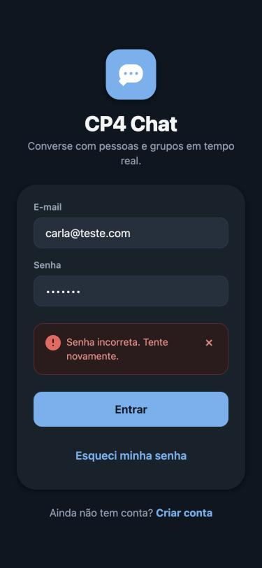 | 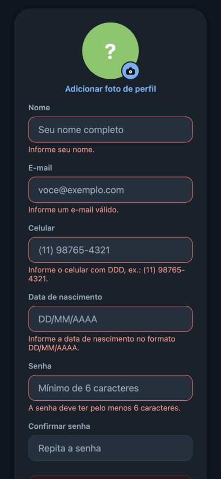 | 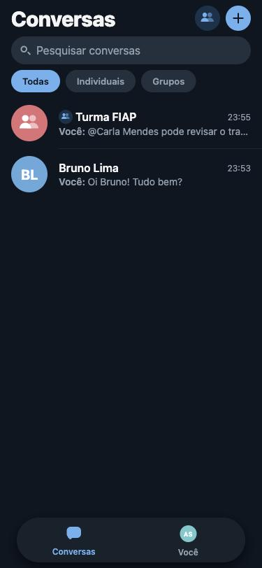 | 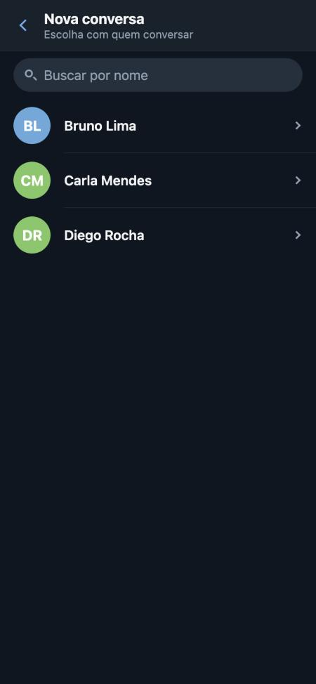 |

| Chat individual | Perfil | Novo grupo | Seleção com limite |
| --- | --- | --- | --- |
| 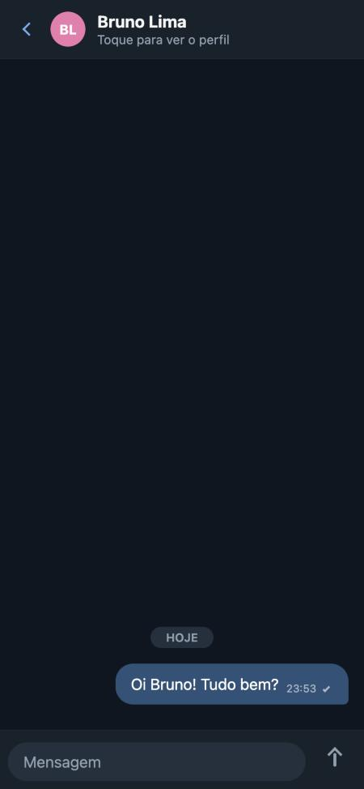 | 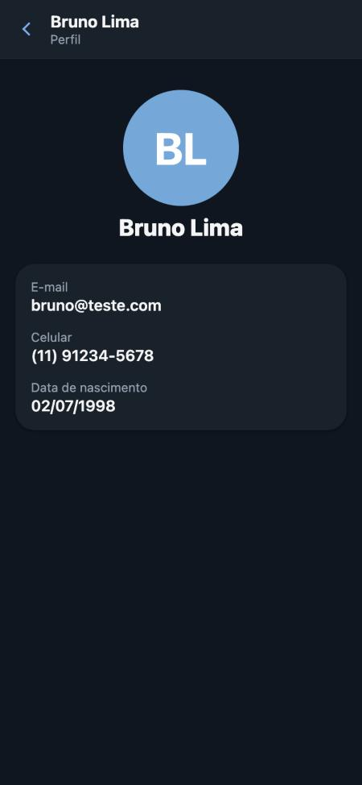 | 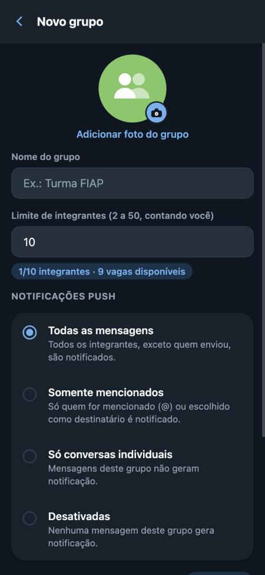 | 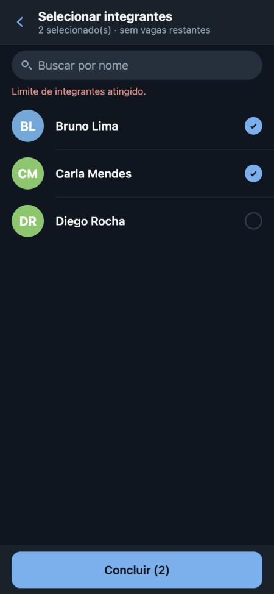 |

| Integrantes | Grupo com menção | Removido do grupo | Você |
| --- | --- | --- | --- |
| 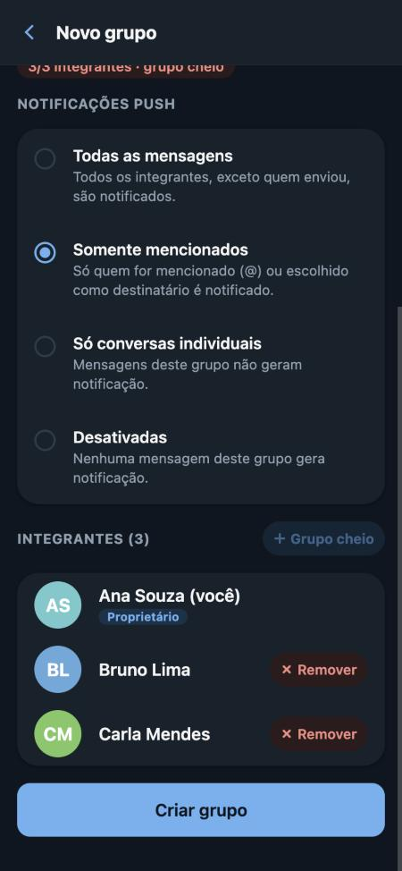 | 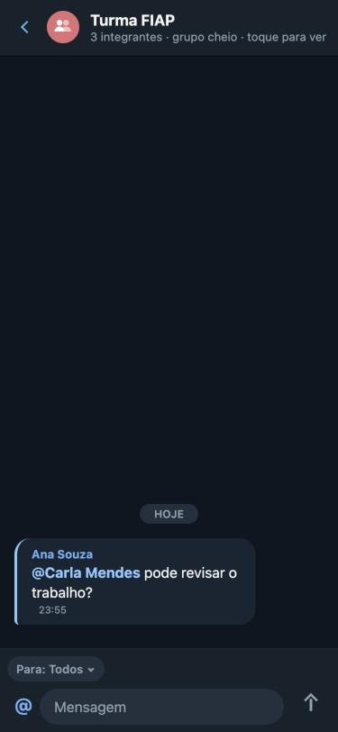 | 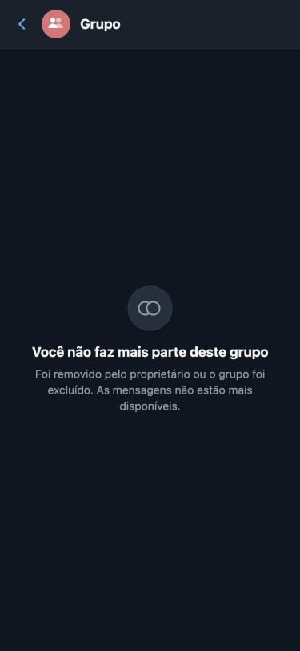 | 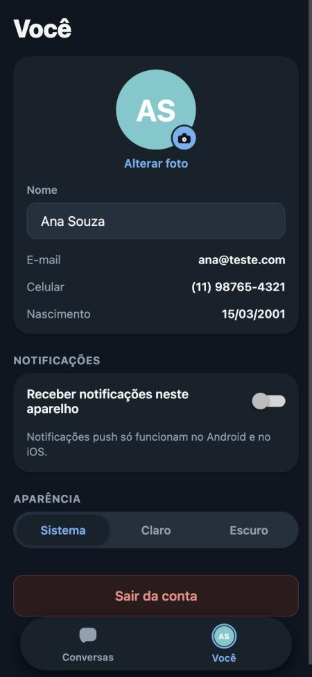 |

### Evidência de notificação recebida

Push real recebido no development build Android (emulador Pixel 9 com Google Play, Android 16),
com o app em segundo plano. A mensagem foi enviada pelo app web; a API no Cloud Run calculou o
destinatário e disparou o FCM. Título com o nome de quem enviou e corpo sem o texto da mensagem.

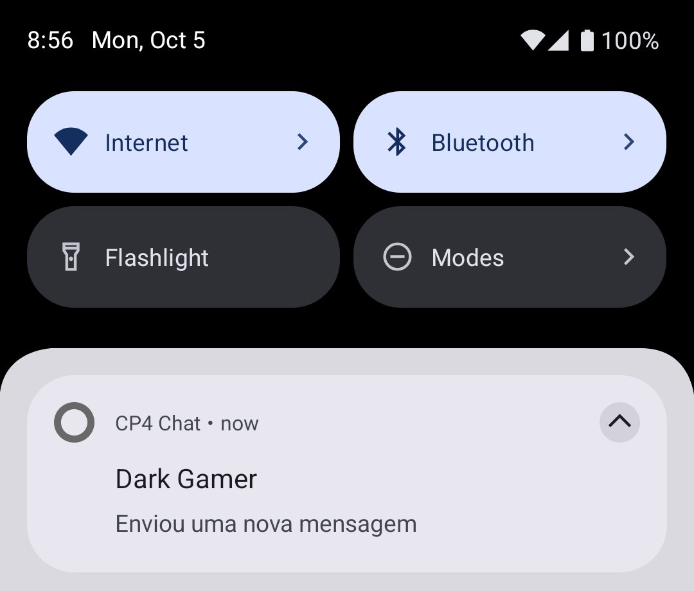

---

## ✅ Checklist

- [x] React Native, Expo SDK 57 e TypeScript, sem `any`
- [x] Cadastro e login apenas com e-mail/senha (nome, celular, nascimento, foto)
- [x] Logout e recuperação de sessão
- [x] Conversas individuais com exatamente dois participantes e id determinístico
- [x] Perfil acessível pela foto do participante e pela lista de integrantes
- [x] Criação e edição de grupos, foto do grupo, lista de integrantes
- [x] Limite configurável, vagas restantes e proteção contra concorrência (transação + teste)
- [x] Mensagens no Realtime Database com atualização em tempo real
- [x] Perfis, grupos, políticas e tokens no Firestore
- [x] Imagens no Firebase Storage, só URLs no Firestore
- [x] FCM no Android e iOS; push enviado pela API com ID token; sem Cloud Functions
- [x] Políticas `all_group_messages`, `mentioned_members`, `direct_messages_only`, `disabled`
- [x] Remetente excluído; tokens inválidos removidos; chamadas duplicadas sem push repetido
- [x] Toque na notificação abre a conversa correta
- [x] Regras do Firestore, Realtime Database e Storage versionadas e testadas
- [x] `firebaseConfig.json` e `.env.example` (app e API) sem segredos
- [x] Credenciais administrativas fora do app e do GitHub
